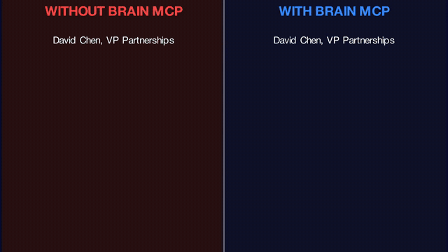

# 🧠 brain-mcp

**Your AI has amnesia. You don't have to.**

*Other AI memory tools remember facts. brain-mcp remembers how you think.*

[](https://github.com/mordechaipotash/brain-mcp/stargazers)
[](https://pypi.org/project/brain-mcp/)
[](https://pypi.org/project/brain-mcp/)
[](LICENSE)
[](https://brainmcp.dev)

<p align="center">
  
</p>

<p align="center"><i>⬆️ Auto-playing preview — <a href="https://github.com/user-attachments/assets/90220a62-2d4e-4dfe-aaa3-2a04172b47b8">click here for full video with audio</a></i></p>

<p align="center">
  <b><a href="https://brainmcp.dev">📚 Docs</a></b> · <b><a href="https://brainmcp.dev/docs/quickstart">🚀 Quickstart</a></b> · <b><a href="https://brainmcp.dev/faq">❓ FAQ</a></b>
</p>

---

## Built with ADHD in mind

brain-mcp is a **cognitive prosthetic**. If your brain drops context constantly, this is your external hard drive.

Neurotypical productivity tools assume you can hold everything in working memory. brain-mcp assumes you can't — and builds the scaffolding so you don't have to.

Context switch without fear. Go deep without mourning abandoned threads. Come back to any project and pick up exactly where you left off.

---

## The Problem

You had a breakthrough at 2am last Tuesday. You laid out a whole framework in a conversation with Claude. It was brilliant.

You can't find it. You can't even remember which conversation it was in.

**Every week, millions of people pour their best thinking into AI conversations — and lose all of it.** ChatGPT's "memory" stores a few fun facts. None of them let you *search your own thinking*.

The real cost isn't forgetting. It's the **anxiety of knowing you'll forget.** Every time you go deep on a problem, part of your brain is mourning the other threads you're abandoning. brain-mcp eliminates that. Your threads survive. You can go deeper.

**Without brain-mcp:**
> *"I had this great idea about the business plan last month... which conversation was it... was it ChatGPT or Claude..."*
> 30 minutes later: Maybe 60% recovered. If you're lucky.

**With brain-mcp:**
```
> "Where did I leave off with the business strategy?"

🧠 business-strategy — exploring stage
Open questions: 12 | Decisions made: 8

❓ Top open:
  - Should I focus on B2B or B2C first?
  - What pricing model fits the early stage?

✅ Recent decisions:
  - Target solo developers initially
  - Open-source core, paid hosting layer

💬 Found across: 15 ChatGPT + 8 Claude + 3 Claude Code conversations
⏱️ 12ms
```

12 milliseconds to reconstruct the mental state that took weeks to build. That's real data, not a mockup.

---

## Install

```bash
pipx install brain-mcp
brain-mcp setup
```

That's it. `setup` discovers your conversations, imports them, creates embeddings, and configures your AI tools — all automatically.

Restart your AI client. Say **"use brain"** in any conversation. Done.

<details>
<summary>pip install / manual options</summary>

```bash
pip install brain-mcp
brain-mcp setup
```

Configure specific clients:

```bash
brain-mcp setup --client claude     # Claude Desktop + Code
brain-mcp setup --client cursor     # Cursor
brain-mcp setup --client windsurf   # Windsurf
```

</details>

---

## What You Can Do

| Ask your AI | What happens |
|-------------|-------------|
| *"Where did I leave off with the business plan?"* | Reconstructs your context — open questions, decisions, next steps |
| *"What do I actually think about AI?"* | Synthesizes YOUR views from 31 past conversations into one answer |
| *"What did I figure out about sleep last month?"* | Finds insights across 12 conversations you forgot you had |
| *"How has my thinking about career changes evolved?"* | Tracks your opinion trajectory from doubt → clarity |
| *"What's unfinished right now?"* | Shows every open thread across every domain |

---

## 8 Core Tools

| Tool | What it does |
|------|-------------|
| `semantic_search` | Find anything by meaning, not just keywords |
| `search_conversations` | Keyword search across all conversations |
| `tunnel_state` | "Load your save game" — where you left off in any domain |
| `what_do_i_think` | Synthesize your views from months of conversations |
| `thinking_trajectory` | How your ideas evolved over time |
| `context_recovery` | Full re-entry brief for returning to a domain |
| `open_threads` | Everything unfinished, everywhere |
| `brain_stats` | Overview of your indexed brain |

<details>
<summary><b>All 25 tools →</b></summary>

| Tool | Category | What it does |
|------|----------|-------------|
| `semantic_search` | Search | Find anything by meaning across all conversations |
| `search_conversations` | Search | Keyword search across all conversations |
| `unified_search` | Search | Combined keyword + semantic search |
| `search_docs` | Search | Search documentation and knowledge files |
| `search_summaries` | Search | Search conversation summaries by topic |
| `get_conversation` | Browse | Read a specific conversation by ID |
| `conversations_by_date` | Browse | Browse conversations by date range |
| `tunnel_state` | Prosthetic | Reconstruct where you left off in any domain |
| `tunnel_history` | Prosthetic | Full history of a domain's evolution |
| `switching_cost` | Prosthetic | Quantified cost of context-switching between domains |
| `dormant_contexts` | Prosthetic | Topics you were working on but silently dropped |
| `thinking_trajectory` | Prosthetic | How your ideas evolved over time |
| `what_do_i_think` | Prosthetic | Synthesize your views from months of conversations |
| `alignment_check` | Prosthetic | Check decisions against your own stated principles |
| `context_recovery` | Prosthetic | Full re-entry brief for any domain |
| `open_threads` | Synthesis | Everything unfinished, everywhere |
| `unfinished_threads` | Synthesis | Detailed unfinished work per domain |
| `what_was_i_thinking` | Synthesis | Stream-of-consciousness reconstruction |
| `cognitive_patterns` | Analytics | Patterns in when and how you think |
| `query_analytics` | Analytics | Query-level analytics on your brain usage |
| `brain_stats` | Stats | Overview of your indexed brain |
| `trust_dashboard` | Stats | Data quality and coverage metrics |
| `get_principle` | Principles | Retrieve a stored principle by key |
| `list_principles` | Principles | List all stored principles |
| `github_search` | Integration | Search your GitHub activity |

</details>

---

### Progressive Tiers — Every tool works at every level

| What you have | What works |
|---------------|-----------|
| Just conversations | Keyword search, date browsing, stats |
| + Embeddings | Semantic search, synthesis, trajectory |
| + Summaries | Full prosthetic tools with structured domain analysis |

`brain-mcp setup` gets you through all three tiers automatically.

---

## Supported Sources

Auto-detected and imported during setup:

| Source | Status |
|--------|--------|
| Claude Code | ✅ Supported |
| Claude Desktop | ✅ Supported |
| Cursor | ✅ Supported |
| Windsurf | ✅ Supported |
| Gemini CLI | ✅ Supported |

<details>
<summary><b>Manual import sources</b></summary>

| Source | How |
|--------|-----|
| ChatGPT | Export from Settings → Data Controls → Export, then `brain-mcp ingest --source chatgpt --path export.zip` |
| Clawdbot | `brain-mcp ingest --source clawdbot --path /path/to/sessions/` |
| Generic JSONL | `brain-mcp ingest --source generic --path conversations.jsonl` |

</details>

---

## How It Works

1. **Install** — 30 seconds, one command
2. **It finds your conversations automatically** — Claude Code sessions, Cursor history, desktop app logs. They're already on your machine.
3. **Your AI searches your brain** — 12ms. Ask Claude "where did I leave off?" and it reconstructs your mental state from months of conversations.

All data stays on your machine. Embedding model runs locally. **No cloud. No API costs. No accounts.**

---

## 🔒 Privacy

- **100% local** — all data stays on your machine
- **No telemetry** — zero tracking, zero phone-home
- **No cloud dependency** — works offline after setup
- **Open source** — audit every line ([MIT licensed](LICENSE))

---

## Requirements

- Python 3.11+
- macOS (Apple Silicon recommended), Linux, or WSL

---

## Contributing

See [CONTRIBUTING.md](CONTRIBUTING.md). All contributions welcome.

---

<div align="center">

*Built because losing your train of thought shouldn't mean starting over.*

**[brainmcp.dev](https://brainmcp.dev)** · **[PyPI](https://pypi.org/project/brain-mcp/)** · **[Full Docs](https://brainmcp.dev/docs/quickstart)**

⭐ If this is useful, a star helps others find it.

</div>
