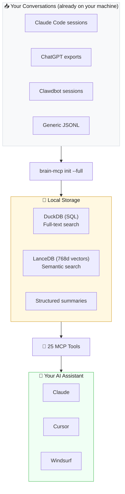

# 🧠 brain-mcp

**You've had thousands of AI conversations. You can't search any of them.**

[](https://brainmcp.dev)
[](https://python.org)
[](https://modelcontextprotocol.io)
[](https://lancedb.com)
[](LICENSE)

<p align="center">
  
</p>

<p align="center"><i>⬆️ Auto-playing preview — <a href="https://github.com/user-attachments/assets/90220a62-2d4e-4dfe-aaa3-2a04172b47b8">click here for full video with audio</a></i></p>

<p align="center">
  <b><a href="https://brainmcp.dev">📚 Documentation</a></b> · <b><a href="https://brainmcp.dev/docs/quickstart">🚀 Quickstart</a></b> · <b><a href="https://brainmcp.dev/faq">❓ FAQ</a></b> · <b><a href="https://brainmcp.dev/docs/tools">🔧 All 25 Tools</a></b>
</p>

---

## Install

```bash
pip install brain-mcp
brain-mcp init --full
brain-mcp setup claude
```

Restart Claude. Done. **25 tools available.**

---

## What You Can Do

| Ask your AI | What happens |
|-------------|-------------|
| "Search my conversations about auth" | Finds 23 conversations across 8 months, with quotes |
| "What do I think about microservices?" | Synthesizes your views from 31 past conversations |
| "Where did I leave off with the DB redesign?" | Reconstructs your context — open questions, last decisions, 12ms |
| "How has my thinking about testing evolved?" | Tracks your opinion trajectory over time |
| "Should I switch to a monorepo?" | Checks alignment with your stated principles |
| "What would it cost to switch focus right now?" | Quantifies switching cost — open threads you'd abandon |

---

## The Problem Nobody Talks About

You're mid-sprint on an auth system. You get pulled into a meeting about the data pipeline. Two hours later, you can't remember what you were doing. Not just "where was I in the code" — you've lost the *entire mental model*. The decisions you'd already made. The approach you'd chosen. The three things you'd decided *not* to do and why.

Most memory tools store *facts*. brain-mcp reconstructs *cognitive state* — where you were in a problem, what you'd decided, what questions were still open, and what it would cost to switch away.

### Without vs. With

**Without:**

> *"I was working on something with embeddings last month... let me check my chat history... which conversation was it..."*
>
> **30 minutes later:** Maybe 60% recovered.

**With:**

```
> tunnel_state("ai-dev")

🧠 ai-dev — executing stage
Open questions: 38 | Decisions made: 33

❓ Top open:
  - What are the results of the 3-model A/B test?
  - How does the improved prompt v6 perform?

✅ Recent decisions:
  - Run the 3-model A/B test using prompt v6
  - Upgrade to GPT-4o structured output

⏱️ 12ms
```

12 milliseconds to reconstruct the mental state that took weeks to build. That's real data, not a mockup.

---

## How It Works



All data stays on your machine. Embedding model runs locally (nomic-v1.5 on Apple Silicon). **No cloud. No API costs for core operations.**

---

## 25 Tools

### 🧠 Cognitive Prosthetic (8)

The tools that make this different from every other memory system.

| Tool | What it does | Speed |
|------|-------------|-------|
| `tunnel_state` | "Load your save game" — reconstructs where you were in any domain | 12ms |
| `context_recovery` | Full re-entry brief with summaries, open questions, decisions | 12ms |
| `switching_cost` | Quantified cost of switching between domains | 9ms |
| `open_threads` | Everything unfinished, everywhere | 2.7s |
| `dormant_contexts` | Abandoned domains with open questions you forgot about | 2.7s |
| `cognitive_patterns` | When and how you think best, with data | 10ms |
| `tunnel_history` | Engagement timeline for a domain | 5ms |
| `trust_dashboard` | System-wide proof the safety net works | 59ms |

### 🔍 Search (6)

| Tool | What it does |
|------|-------------|
| `semantic_search` | Vector search via LanceDB (768d nomic embeddings) |
| `search_conversations` | Keyword search across all conversations |
| `unified_search` | Search conversations + GitHub + markdown at once |
| `search_summaries` | Structured summaries (extract: decisions/questions/quotes) |
| `search_docs` | Markdown corpus search |
| `unfinished_threads` | Threads with open questions by domain |

### 🔬 Synthesis (4)

| Tool | What it does |
|------|-------------|
| `what_do_i_think` | Synthesized view of your position on any topic |
| `alignment_check` | Check decisions against your own stated principles |
| `thinking_trajectory` | How an idea evolved over time |
| `what_was_i_thinking` | Month-level snapshot of your focus |

### 💬 Conversation + Stats (5)

`get_conversation` · `conversations_by_date` · `brain_stats` · `query_analytics` · `github_search`

### ⚙️ Meta (2)

`list_principles` · `get_principle`

---

## Progressive Tiers

Every tool works at every tier — just with increasing depth:

| What you have | What works |
|---------------|-----------|
| Just conversations | Keyword search, date browsing, stats |
| + Embeddings | Semantic search, synthesis, trajectory |
| + Summaries | Full prosthetic tools with structured domain analysis |

---

## Comparison

| | **brain-mcp** | **Mem0** | **Khoj** | **Letta (MemGPT)** |
|---|---|---|---|---|
| **Memory model** | Conversation archaeology — reconstructs cognitive state | Key-value fact store | Hybrid search over docs | Tiered agent memory |
| **State recovery** | 8 prosthetic tools (tunnel state, switching cost, dormancy) | ❌ | ❌ | ❌ |
| **Data source** | Your existing AI conversations (auto-discovered) | Runtime extractions | Personal documents | Agent conversation history |
| **Runs where** | 100% local (Apple Silicon optimized) | Cloud API or self-hosted | Self-hosted or cloud | Self-hosted or cloud |
| **Domain tracking** | 25 cognitive domains with stages, open questions, decisions | ❌ | ❌ | ❌ |
| **Cost** | ~$0.05/day | Free tier / paid | Free / self-hosted | Free / self-hosted |
| **Protocol** | MCP (Claude, Cursor, any client) | REST API | REST API + web UI | REST API |

---

## CLI

```bash
brain-mcp init              # Discover conversation sources
brain-mcp init --full       # Discover + import + embed (one command)
brain-mcp setup claude      # Configure Claude Desktop / Claude Code
brain-mcp setup cursor      # Configure Cursor
brain-mcp doctor            # Health check
brain-mcp sync              # Incremental update
brain-mcp status            # One-line status
```

---

## Supported Sources

| Source | Auto-detected | Status |
|--------|:---:|--------|
| Claude Code | ✅ | Supported |
| Claude Desktop | ✅ | Supported |
| ChatGPT | ✅ | Supported |
| Clawdbot | ✅ | Supported |
| Cursor | — | Coming soon |
| Windsurf | — | Coming soon |
| Generic JSONL | Manual | Supported |

---

## Requirements

- Python 3.11+
- ~500MB disk, ~2GB RAM for embedding
- macOS (Apple Silicon recommended), Linux, or WSL

---

## Part of the Ecosystem

| Repo | What |
|------|------|
| **[brain-mcp](https://github.com/mordechaipotash/brain-mcp)** | Memory — 25 MCP tools, cognitive prosthetic |
| **[QinBot](https://github.com/mordechaipotash/qinbot)** | AI on a $50 dumb phone — no browser, no apps |
| **[local-voice-ai](https://github.com/mordechaipotash/local-voice-ai)** | Voice — Kokoro TTS + Parakeet STT, zero cloud |
| **[agent-memory-loop](https://github.com/mordechaipotash/agent-memory-loop)** | Cron + memory cascade for AI agents |
| **[brain-canvas](https://github.com/mordechaipotash/brain-canvas)** | Visual display for any LLM |
| **[x-search](https://github.com/mordechaipotash/x-search)** | Search X/Twitter from terminal via Grok |
| **[mordenews](https://github.com/mordechaipotash/mordenews)** | Automated daily AI podcast |
| **[live-translate](https://github.com/mordechaipotash/live-translate)** | Real-time Hebrew→English translation |

---


## 🔒 Privacy & Security

- **100% local** — all data stays on your machine
- **No telemetry** — zero tracking, zero phone-home
- **No cloud dependency** — works offline after initial setup
- **No accounts** — no sign-up, no API keys for core features
- **You own everything** — MIT licensed, your data is yours
- **Open source** — audit every line of code

---

## Documentation

## 🔒 Privacy & Security

- **100% local** — all data stays on your machine
- **No telemetry** — zero tracking, zero phone-home
- **No cloud dependency** — works offline after initial setup
- **No accounts** — no sign-up, no API keys for core features
- **You own everything** — MIT licensed, your data is yours
- **Open source** — audit every line of code


Full documentation at **[brainmcp.dev](https://brainmcp.dev)** — quickstart, tool reference, integration guides, and FAQ.

---

## License

MIT — see [LICENSE](LICENSE).

---

<div align="center">

*Built because losing your train of thought shouldn't mean starting over.*

**[brainmcp.dev](https://brainmcp.dev)**

</div>
