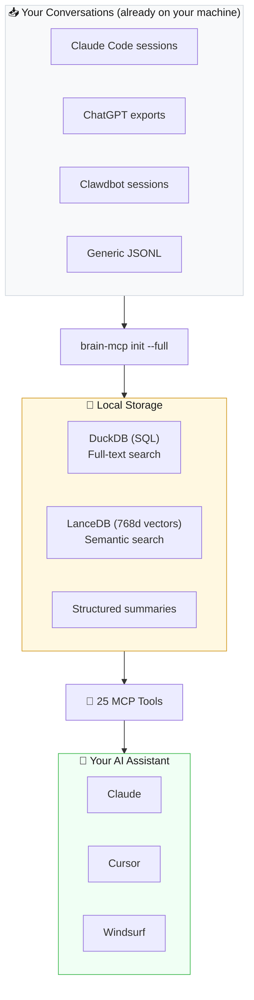

# 🧠 brain-mcp

**You've had thousands of AI conversations. You can't search any of them.**

[](https://brainmcp.dev)
[](https://python.org)
[](https://modelcontextprotocol.io)
[](https://lancedb.com)
[](LICENSE)
[](https://pypi.org/project/brain-mcp/)
[](https://github.com/mordechaipotash/brain-mcp/actions)

<p align="center">
  
</p>

<p align="center"><i>⬆️ Auto-playing preview — <a href="https://github.com/user-attachments/assets/90220a62-2d4e-4dfe-aaa3-2a04172b47b8">click here for full video with audio</a></i></p>

<p align="center">
  <b><a href="https://brainmcp.dev">📚 Documentation</a></b> · <b><a href="https://brainmcp.dev/docs/quickstart">🚀 Quickstart</a></b> · <b><a href="https://brainmcp.dev/faq">❓ FAQ</a></b> · <b><a href="https://brainmcp.dev/docs/tools">🔧 All 25 Tools</a></b>
</p>

<p align="center">
  <sub>If this is useful, a ⭐ helps others find it.</sub>
</p>

---

## Install

```bash
pipx install brain-mcp          # recommended (isolated env, on your PATH)
brain-mcp init                   # discover your conversations
brain-mcp ingest                 # import them (fast, no GPU)
brain-mcp setup claude           # auto-configure Claude Desktop + Code
```

Restart Claude. **25 tools available.** Keyword search works immediately.

```bash
# Optional: enable semantic search (downloads ~1.5GB embedding model)
pipx inject brain-mcp sentence-transformers einops
brain-mcp embed
```

<details>
<summary>Alternative: pip install</summary>

```bash
pip install brain-mcp
brain-mcp init && brain-mcp ingest
brain-mcp setup claude

# Optional: semantic search
pip install brain-mcp[embed]
brain-mcp embed
```

> **Note:** If you install in a virtualenv, make sure `brain-mcp` is on your PATH — Claude Desktop/Code needs to find the binary. `pipx` handles this automatically.

</details>

<details>
<summary>Setup for specific clients</summary>

```bash
brain-mcp setup claude           # auto-detect: configures both Desktop + Code
brain-mcp setup claude-desktop   # Claude Desktop only
brain-mcp setup claude-code      # Claude Code only
brain-mcp setup cursor           # Cursor
brain-mcp setup windsurf         # Windsurf
```

</details>

---

## Using It

After setup, just say **"use brain"** in any conversation with Claude, Cursor, or Windsurf. Your AI instantly gains access to your full thinking history.

That's it. No special syntax. Just talk to your AI and it searches your brain when relevant.

---

## What You Can Do

| Ask your AI | What happens |
|-------------|-------------|
| "What did I figure out about sleep last month?" | Finds your insights across 12 conversations you forgot you had |
| "Search everything I've discussed about marketing" | 23 conversations across 8 months, with quotes — in 12ms |
| "Where did I leave off with the business plan?" | Reconstructs your context — open questions, decisions, next steps |
| "How has my thinking about career changes evolved?" | Tracks your opinion trajectory from doubt → clarity |
| "What would it cost to switch focus right now?" | Quantifies what you'd abandon — open threads, unfinished thinking |
| "What do I actually think about AI?" | Synthesizes YOUR views from 31 past conversations into one answer |

Works for **researchers, writers, students, founders, developers** — anyone who thinks with AI.

---

## The Problem Nobody Talks About

You had a breakthrough at 2am last Tuesday. You laid out a whole framework in a conversation with Claude. It was brilliant.

You can't find it. You can't even remember which conversation it was in.

**Every week, millions of people pour their best thinking into AI conversations — and lose all of it.** ChatGPT's "memory" stores a few fun facts. Claude's import tool gives you a markdown summary of a summary. None of them let you *search your own thinking*.

brain-mcp doesn't store facts. It reconstructs **cognitive state** — where you were in a problem, what you'd decided, what questions were still open, and what it would cost to switch away.

> *Built with ADHD in mind. If your brain drops context constantly, this is your external hard drive.*

### Without vs. With

**Without brain-mcp:**

> *"I had this great idea about the business plan last month... let me search my chat history... which conversation was it... was it ChatGPT or Claude..."*
>
> **30 minutes later:** Maybe 60% recovered. If you're lucky.

**With brain-mcp:**

```
> "Where did I leave off with the business strategy?"

🧠 business-strategy — exploring stage
Open questions: 12 | Decisions made: 8

❓ Top open:
  - Should I focus on B2B or B2C first?
  - What pricing model fits the early stage?

✅ Recent decisions:
  - Target solo developers initially
  - Open-source core, paid hosting layer

💬 Found across: 15 ChatGPT + 8 Claude + 3 Claude Code conversations

⏱️ 12ms
```

12 milliseconds to reconstruct the mental state that took weeks to build. Across every AI tool you've used. That's real data, not a mockup.

---

## How It Works



All data stays on your machine. Embedding model runs locally (nomic-v1.5 on Apple Silicon). **No cloud. No API costs for core operations.**

---

## 25 Tools

### 🧠 Cognitive Prosthetic (8)

The tools that make this different from every other memory system.

| Tool | What it does | Speed |
|------|-------------|-------|
| `tunnel_state` | "Load your save game" — reconstructs where you were in any domain | 12ms |
| `context_recovery` | Full re-entry brief with summaries, open questions, decisions | 12ms |
| `switching_cost` | Quantified cost of switching between domains | 9ms |
| `open_threads` | Everything unfinished, everywhere | 2.7s |
| `dormant_contexts` | Abandoned domains with open questions you forgot about | 2.7s |
| `cognitive_patterns` | When and how you think best, with data | 10ms |
| `tunnel_history` | Engagement timeline for a domain | 5ms |
| `trust_dashboard` | System-wide proof the safety net works | 59ms |

### 🔍 Search (6)

| Tool | What it does |
|------|-------------|
| `semantic_search` | Vector search via LanceDB (768d nomic embeddings) |
| `search_conversations` | Keyword search across all conversations |
| `unified_search` | Search conversations + GitHub + markdown at once |
| `search_summaries` | Structured summaries (extract: decisions/questions/quotes) |
| `search_docs` | Markdown corpus search |
| `unfinished_threads` | Threads with open questions by domain |

### 🔬 Synthesis (4)

| Tool | What it does |
|------|-------------|
| `what_do_i_think` | Synthesized view of your position on any topic |
| `alignment_check` | Check decisions against your own stated principles |
| `thinking_trajectory` | How an idea evolved over time |
| `what_was_i_thinking` | Month-level snapshot of your focus |

### 💬 Conversation + Stats (5)

`get_conversation` · `conversations_by_date` · `brain_stats` · `query_analytics` · `github_search`

### ⚙️ Meta (2)

`list_principles` · `get_principle`

---

## Progressive Tiers

Every tool works at every tier — just with increasing depth:

| What you have | What works |
|---------------|-----------|
| Just conversations | Keyword search, date browsing, stats |
| + Embeddings | Semantic search, synthesis, trajectory |
| + Summaries | Full prosthetic tools with structured domain analysis |

---

## Comparison

| | **brain-mcp** | **Mem0** | **Khoj** | **Letta (MemGPT)** |
|---|---|---|---|---|
| **Memory model** | Conversation archaeology — reconstructs cognitive state | Key-value fact store | Hybrid search over docs | Tiered agent memory |
| **State recovery** | 8 prosthetic tools (tunnel state, switching cost, dormancy) | ❌ | ❌ | ❌ |
| **Data source** | Your existing AI conversations (auto-discovered) | Runtime extractions | Personal documents | Agent conversation history |
| **Runs where** | 100% local (Apple Silicon optimized) | Cloud API or self-hosted | Self-hosted or cloud | Self-hosted or cloud |
| **Domain tracking** | 25 cognitive domains with stages, open questions, decisions | ❌ | ❌ | ❌ |
| **Cost** | ~$0.05/day | Free tier / paid | Free / self-hosted | Free / self-hosted |
| **Protocol** | MCP (Claude, Cursor, any client) | REST API | REST API + web UI | REST API |

---


## 🔒 Privacy & Security

- **100% local** — all data stays on your machine
- **No telemetry** — zero tracking, zero phone-home
- **No cloud dependency** — works offline after initial setup
- **No accounts** — no sign-up, no API keys for core features
- **You own everything** — MIT licensed, your data is yours
- **Open source** — audit every line of code

---

## CLI

```bash
brain-mcp init              # Discover conversation sources
brain-mcp init --full       # Discover + import + embed (one command)
brain-mcp setup claude      # Configure Claude Desktop / Claude Code
brain-mcp setup cursor      # Configure Cursor
brain-mcp doctor            # Health check
brain-mcp sync              # Incremental update
brain-mcp status            # One-line status
```

---

## Supported Sources

| Source | Auto-detected | Status |
|--------|:---:|--------|
| Claude Code | ✅ | Supported |
| Claude Desktop | ✅ | Supported |
| ChatGPT | ✅ | Supported |
| Clawdbot | ✅ | Supported |
| Cursor | — | Coming soon |
| Windsurf | — | Coming soon |
| Generic JSONL | Manual | Supported |

---

## Requirements

- Python 3.11+
- ~500MB disk, ~2GB RAM for embedding
- macOS (Apple Silicon recommended), Linux, or WSL

---

## Part of the Ecosystem

| Repo | What |
|------|------|
| **[brain-mcp](https://github.com/mordechaipotash/brain-mcp)** | Memory — 25 MCP tools, cognitive prosthetic |
| **[QinBot](https://github.com/mordechaipotash/qinbot)** | AI on a $50 dumb phone — no browser, no apps |
| **[local-voice-ai](https://github.com/mordechaipotash/local-voice-ai)** | Voice — Kokoro TTS + Parakeet STT, zero cloud |
| **[agent-memory-loop](https://github.com/mordechaipotash/agent-memory-loop)** | Cron + memory cascade for AI agents |
| **[brain-canvas](https://github.com/mordechaipotash/brain-canvas)** | Visual display for any LLM |
| **[x-search](https://github.com/mordechaipotash/x-search)** | Search X/Twitter from terminal via Grok |
| **[mordenews](https://github.com/mordechaipotash/mordenews)** | Automated daily AI podcast |
| **[live-translate](https://github.com/mordechaipotash/live-translate)** | Real-time Hebrew→English translation |

--
## Contributing

See [CONTRIBUTING.md](CONTRIBUTING.md) for development setup, testing, and PR guidelines. All contributions welcome.

---

## License

MIT — see [LICENSE](LICENSE). See [CHANGELOG.md](CHANGELOG.md) for version history.

---

<div align="center">

*Built because losing your train of thought shouldn't mean starting over.*

**[brainmcp.dev](https://brainmcp.dev)** · **[Full Docs](https://brainmcp.dev/docs/quickstart)** · **[PyPI](https://pypi.org/project/brain-mcp/)**

</div>
